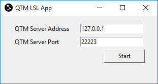
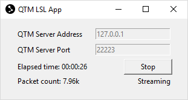

# Qualisys Lab Streaming Layer App
Stream Qualisys Track Manager (QTM) 3D and 6DOF data as Lab Streaming Layer (LSL) Motion Capture (MoCap) data.

## Dependencies
- Python 3.5 or above
- Python tkinter (GUI, see google)
- [Qualisys SDK for Python](https://github.com/qualisys/qualisys_python_sdk)
- Python interface to LSL [pylsl](https://github.com/labstreaminglayer/liblsl-Python)

## Installation
1. Upgrade to latest pip
```
python -m pip install pip --upgrade
```
2. Install dependencies
```
python -m pip install -r requirements.txt
```

If this is unsuccessful, consult the links in the dependencies section for instructions on how to manually install them. Also note that some Python installations include tkinter by default and some require you to install it separately.

3. (Optional) Install dev dependencies to be able to run the tests
```
python -m pip install -r requirements-dev.txt
```

## Usage
1. Ensure QTM is running either locally or on an external host that you are able to ping
2. Start LSL App
```
python -m qlsl.gui
```
3. Enter address, port, and start
> 

Once started and connected, the app is either in a Waiting or Streaming state. In the Waiting state there is _no_ LSL stream outlet open, as the app is waiting for QTM to start streaming. When QTM is streaming, the app is in the Streaming state and QTM data is passed through an LSL stream outlet. The app toggles between these states as QTM starts/stops streaming.
> 

