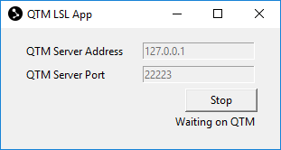

# Qualisys Lab Streaming Layer App
Stream Qualisys Track Manager (QTM) 3D and 6DOF data as Lab Streaming Layer (LSL) Motion Capture (MoCap) data.

## Dependencies
- Python 3.5 or above
- Python tkinter (GUI, see google)
- [Qualisys SDK for Python](https://github.com/qualisys/qualisys_python_sdk)
- Python interface to LSL [pylsl](https://github.com/labstreaminglayer/liblsl-Python)

## Installation
1. Upgrade to latest pip
```
python -m pip install pip --upgrade
```
2. Install dependencies
```
python -m pip install -r requirements.txt
```

If this is unsuccessful, consult the links in the dependencies section for instructions on how to manually install them. Also note that some Python installations include tkinter by default and some require you to install it separately.

3. (Optional) Install dev dependencies to be able to run the tests
```
python -m pip install -r requirements-dev.txt
```
> [!NOTE]
> The installation requires that git is installed on the computer and on the system path.
> 
> Alternatively, you can edit the requirements.txt file, so that it reads:
> ```
> pylsl==1.13.6
> qtm==2.1.1
> ```

## Usage
1. Ensure QTM is running either locally or on an external host that you are able to ping
2. Start LSL App
```
python -m qlsl.gui
```
3. Enter address, port, and start
> 

Once started and connected, the app is either in a Waiting or Streaming state. In the Waiting state there is _no_ LSL stream outlet open, as the app is waiting for QTM to start streaming. When QTM is streaming, the app is in the Streaming state and QTM data is passed through an LSL stream outlet. The app toggles between these states as QTM starts/stops streaming.
> 


## Example
- Streaming data from QTM via QTM LSL App
- Recording the data stream with LSL recorder on the same computer
- Opening the file with xdf reader in Matlab

### Start QTM LSL app
1. Open a CMD window
2. Type:
```
python -m qlsl.gui
```

Use default settings:
- QTM Server Address: 127.0.0.1
- QTM Server Port: 22223

### Start streaming
1. Open QTM and start streaming (RT or from file)
2. Press the Start button in the QTM LSL App

### Test recording
Download and unzip LSL recorder (release for windows) from https://github.com/labstreaminglayer/App-LabRecorder/releases

1. Start LSL recorder (LabRecorder.exe)
-> Qualisys stream shows up in interface (no need to change the port number).
2. Select stream and start recording
3. Stop recording
-> The recording is stored in an xdf file in the Study Root folder specified in Lab Recorder

### Reading the XDF data file in Matlab
Download and unxip xdf reader for Matlab from https://github.com/xdf-modules/xdf-Matlab

In Matlab:
1. Add the xdf reader folder to the Matlab path.
2. Read the recorded file (replace with actual file name):

```
streams = load_xdf('<recorded_file>.xdf');
```

